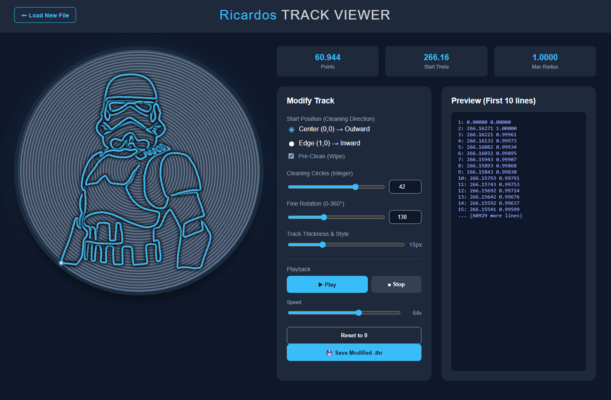

# Ricardos Track Viewer

Ein interaktives Tool zum Visualisieren und Bearbeiten von `.thr` Dateien für Sandtische (Sisyphus, etc.).

## Vorschau

## Funktionen
- **Visualisierung:** Zeigt Theta-Rho Pfade live an.
- **Pre-Clean:** Fügt automatisch eine Reinigungs-Spirale hinzu.
- **Modifikation:** Drehen, Startpunkt anpassen und Reinigungs-Parameter ändern.
- **Export:** Speichert die modifizierte `.thr` Datei.

## Lizenz
MIT License
